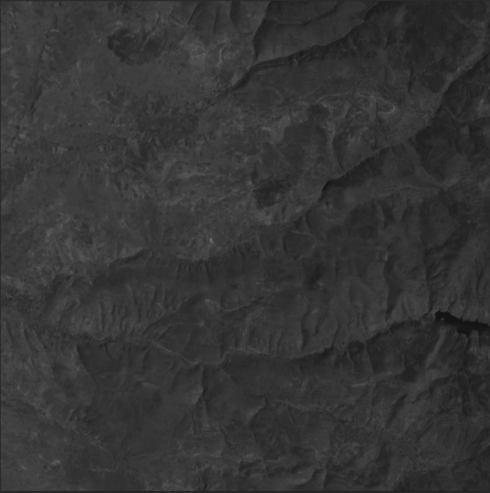

# Landsat 7 SLC-off Gap-filled Tool with AI

This tool is designed to fill gaps in Landsat 7 SLC-off images using artificial intelligence.

## Setup
```bash
# Install the required packages for GDAL
sudo apt install gdal-bin python3-gdal

# Create a virtual environment
python3.10 -m venv venv
source venv/bin/activate
pip3 install --upgrade pip

# Then install the repository
cd ./eliminating_stripe_errors
pip3 install -r requirements.txt
mkdir -p ./data ./models ./saves
```

---

## Usage

The `inference.ipynb` notebook contains two types of inference:
- Single Model Inference
- Multi Model Inference

### Single Model Inference
This is the inference type where a single model is used.

- Place the model you wish to use for inference in the `models` folder.
- Specify the path of the model in the `single_model_path` parameter within the `config.yaml` file.
- Execute the code cells in the _Initialize_ section to load the dataset and model.
- Perform inference with the loaded model in the _Single Model Inference_ section.

### Multi Model Inference
This is the inference type where multiple models are used.

- Place the models you wish to use for inference in the `models` folder.
- Execute the code cells in the _Initialize_ section to load the datasets and models.
- Perform inference with the loaded models in the _Multi Model Inference_ section.

---

## Models
| Model | Input Size |
|-------|------------|
| [Model A1](https://drive.google.com/file/d/1v9PH_NQHjsLlnXxGYCfHaF3uh40cDm2c/view?usp=sharing) | 512x512x1 |
| [Model A2](https://drive.google.com/file/d/11OrdwSTvMR27uo7p4Zf-pO7KvlOxjPZ0/view?usp=sharing) | 512x512x1 |
| [Model A3](https://drive.google.com/file/d/1Ch12Hhi7ufUX0Qf3bUDC2kKgErfavc5S/view?usp=sharing) | 1024x1024x1 |
| [Model A4](https://drive.google.com/file/d/1EPlJvQ2yc9FtljESKwUnvoz3Q9CBqMZ3/view?usp=sharing) | 1024x1024x1 |

In the `inference.ipynb` code, models with input sizes of 512x512 perform inference by dividing inputs of size 1024 into quarters.

---

## Datasets
| Dataset | Image Size | Radiometric Resolution | Bands | Satellite |
|---------|------------|------------------------|-------|-----------|
| [A1 Dataset](https://drive.google.com/file/d/1Iqw0U5xHI3GzBTghizj84hHPkdKyiYSS/view?usp=sharing) | 512x512 | 8 bit | Pan | Landsat 8 ETM+ |
| [A2 Dataset](https://drive.google.com/file/d/1JxQfrr7Mj2gSkjrdGsoIavyzZF-VT0Eh/view?usp=sharing) | 512x512 | 8 bit | Pan | Landsat 8 ETM+ |
| [A3 Dataset](https://drive.google.com/file/d/1GNlXnxLD8IPWPgKTuDieYG94zISrVTHE/view?usp=sharing) | 1024x1024 | 8 bit | Pan | Landsat 8 ETM+ |
| [A4 Dataset](https://drive.google.com/file/d/1llzN29mhx90FIlxNjMmsiNqVC62oOf1J/view?usp=sharing) | 1024x1024 | 8 bit | Pan | Landsat 8 ETM+ |
| [A5 Dataset](https://drive.google.com/file/d/1zAg3tO9nyn5MNetcYlAMPKtQVv2JJCms/view?usp=sharing) | 1024x1024 | 8 bit | Pan | Landsat 7 SLC-off |
| [Test Dataset](https://drive.google.com/file/d/1pWAg5TDK6xS4iIVDcwU7gGB28Z9Fd97e/view?usp=sharing) | 1024x1024 | 8 bit | Pan | Landsat 8 ETM+ |

---

## Example

| Original (1024x1024) | Model A2 Inference (1024x1024) |
|----------|-----------|
|  |  |

## Citation
```

```
